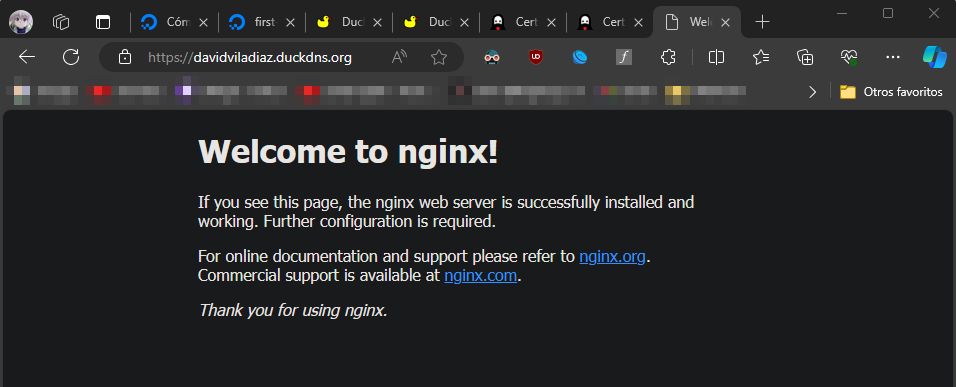
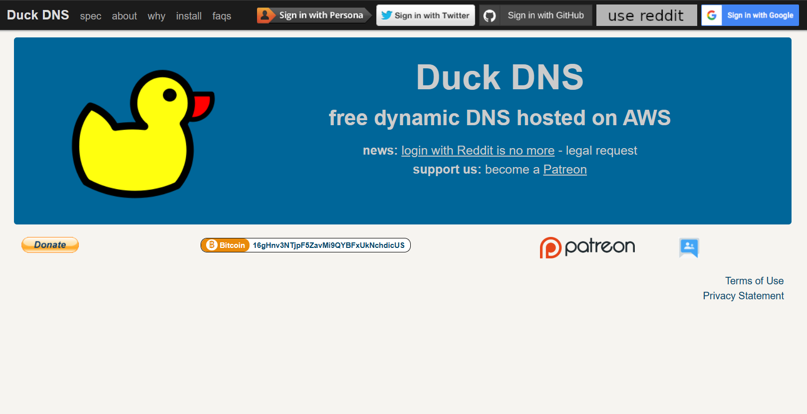
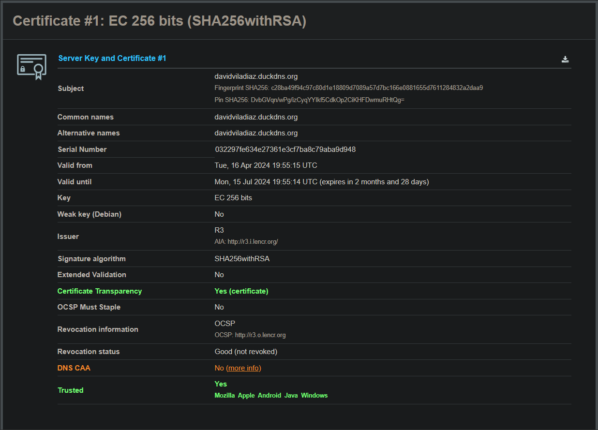

# PROYECTO 9 PARTE 2

He aquí una vista rápida del dominio creado con DUCKDNS:

Esta web es la que me ha posibilitado crear el dominio davidviladiaz.duckdns.org.

Una vez creado el certificado y mi dominio con [D](http://DUCKDNS.ORG)UCKDNS, como se puede apreciar en la imagen anterior, vamos a analizarlo y compararlo con el del dominio del Instituto Rafael Alberti, de manera que otenemos estos dos resultados en SSL Labs:

_y_10_pginas_m.png)

Lo primero que podemos observar, es que existen dos grandes diferencias entre estos dos certificados, en específicamente estos dos campos:

**El tipo de clave:**

- En el primer certificado se utiliza una clave EC (Elliptic Curve) de 256 bits.
- En el segundo certificado utiliza una clave RSA de 2048 bits.

La diferencia entre estos tipos de claves radica en el algoritmo de cifrado utilizado y la longitud de la clave, siendo clara entre los anteriores expuestos. Las claves RSA son más comunes y ampliamente compatibles, mientras que las claves EC tienden a ser más eficientes en términos de rendimiento y tamaño de clave. La elección entre estos dos tipos de claves puede depender de los requisitos de seguridad y compatibilidad del sistema elegido, aunque a día de hoy se prefieren claves de mínimo 2048 bits para obtener un nivel de seguridad aceptable.

**Los nombres**:

- El primer certificado (davidviladiaz.duckdns.org) solo tiene el nombre común como nombre alternativo.
- El certificado del IES Rafael Alberti tiene el nombre común y un nombre alternativo comodín (*.iesrafaelalberti.es), que es válido para todos los subdominios de iesrafaelalberti.es.

Al añadir un nombre alternativo comodín en el segundo certificado se proporciona flexibilidad adicional, lo que permite que el certificado sea válido para cualquier subdominio de iesrafaelalberti.es sin la necesidad de emitir certificados individuales para cada uno. Esto puede ser especialmente útil en entornos donde se necesitan varios subdominios, al contrario del primero.