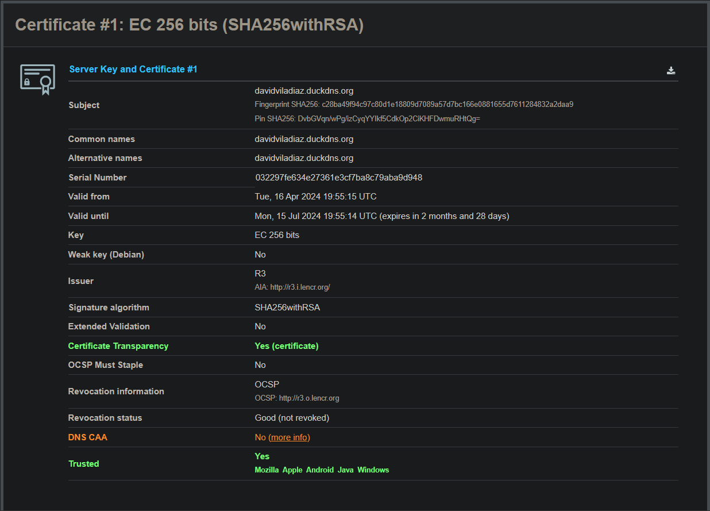

# PROYECTO 9 PARTE 3

Gracias a SSL Labs, he podido recoger la información sobre mi certificado, el cual está listado de esta manera:

Una vez obtenida esta información, podemos deducir que es “válido” como certificado por varias razones:

- El certificado fue emitido el 16 de abril de 2024 y es válido hasta el 15 de julio de 2024, lo que significa que está dentro de su período de validez.
- Este utiliza el algoritmo de firma digital SHA256withRSA, que es un método de cifrado seguro y ampliamente aceptado.
- Está firmado por la autoridad certificadora R3, que es una entidad de confianza reconocida por los principales navegadores y sistemas operativos.
- Y por último, el certificado es compatible con TLS 1.3, el protocolo de seguridad más reciente y seguro para conexiones HTTPS.

Con esto, haremos una explicación de por qué no son válidos los siguientes tres certificados, para así tener en cuenta que factores lo diferencian de uno realmente bien incorporado y válido.

revoked.badssl.com

El certificado ha sido revocado lo cual significa que la entidad emisora del certificado ha terminado su validez antes de la fecha de vencimiento. Y en cuanto al estado OCSP (Protocolo de Estado de Certificado en Línea) para este certificado indica que está revocado. OCSP es un mecanismo para verificar el estado de un certificado en tiempo real.

dh1024.badssl.com

Este certificado utiliza una clave de cifrado **DH (Diffie-Hellman)** de **1024 bits,** con una longitud de clave que se considera insegura en la actualidad debido a los avances en la capacidad de cómputo y la posibilidad de ataques de fuerza bruta. Se recomienda (como comenté en la parte 2) un mínimo de 2048 bits de garantizar seguridad.

untrusted-root.badssl.com

En este caso, el certificado está firmado por una autoridad de certificación que no es ampliamente reconocida ni confiable. Es por ello que, el certificado se ha generado internamente o de manera autónoma, lo que lo hace inválido para la mayoría de los navegadores y sistemas operativos.